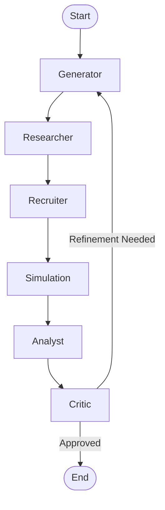

# Multi-Agent System Workflow

This document outlines the architecture and workflow of the Iterative Idea Validator, a system designed to evolve business concepts through simulated customer development.

## 🔄 High-Level Flow

The system operates as a directed cyclic graph (DCG) where business ideas are iteratively refined based on synthetic but data-grounded feedback.

## 🤖 Agents & Roles

### 1. Generator (The Entrepreneur)
*   **Role**: Zero-to-One Creator & Pivot Strategist.
*   **Input**: User's initial prompt or Critic's feedback + Research/Simulation reports.
*   **Action**: Generates a lean canvas, value proposition, and key hypotheses. It evolves the idea in subsequent iterations based on feedback.
*   **Output**: `BusinessIdea` object (Title, Pitch, Hypotheses, Target Audience).

### 2. Researcher (The Interview Designer)
*   **Role**: Methodology Expert.
*   **Input**: `BusinessIdea`.
*   **Action**: Designs a "The Mom Test" compliant interview guide. It identifies the most risky assumptions and crafts non-leading questions to validate them.
*   **Output**: `InterviewGuide` object (Target Personas x3, Hypotheses to Test, 5-7 Deep Interview Questions).

### 3. Recruiter (The Headhunter)
*   **Role**: Audience Sourcing.
*   **Input**: `InterviewGuide` (specifically Target Personas).
*   **Action**: Performs semantic search (Vector Search) over a database of ~20,000 detailed user personas to find the best matches for the target audience.
*   **Output**: List of `RichPersona` objects (Real data: Name, Age, Occupation, Bio, Key Frustrations, Goals).
*   **Logic**:
    *   *Primary*: Search Vector DB for real profiles.
    *   *Fallback*: Generate synthetic personas if no close matches found (rare).

### 4. Simulation (The Virtual Interview)
*   **Role**: User Proxy & Interviewer.
*   **Input**: `InterviewGuide`, List of `RichPersona` objects.
*   **Action**: Conducts valid "The Mom Test" interviews.
    *   *Simulated User*: Adopts the persona's backstory, personality, and tone. Evaluates the idea based on their specific pain points (not just "being nice").
    *   *Interviewer*: Asks questions from the guide, digs deeper into "Why?", and records answers.
*   **Output**: `InterviewResult` objects (Transcript, Pain Level 1-10, Willingness to Pay 1-5).

### 5. Analyst (The Data Scientist)
*   **Role**: Pattern Recognizer.
*   **Input**: All `InterviewResult` transcripts.
*   **Action**: Synthesizes qualitative data. Identifies recurring themes, strong objections, surprising insights, and features that resonated.
*   **Output**: `ResearchReport` (Confirmed Hypotheses, Rejected Hypotheses, Key Insights, Pivot Recommendation).

### 6. Critic (The VC / Product Leader)
*   **Role**: decision Maker & Quality Control.
*   **Input**: `BusinessIdea`, `ResearchReport`.
*   **Action**: Evaluates if the idea has achieved "Product-Market Fit" or needs refinement.
    *   checks for "False Positives" (did the user just say yes to be nice?).
    *   Decides: **Keep**, **Pivot**, or **Kill**.
*   **Output**: `CritiqueFeedback` (Decision, Score 0-100, Reasoning, Strategic Advice).

## 📊 Data Flow & Artifacts

| Node | Input | Artifact Created |
| :--- | :--- | :--- |
| **Generator** | Concept / Feedback | `lean_canvas.md` |
| **Researcher** | Business Idea | `interview_guide.md` |
| **Recruiter** | Target Personas | *(Internal Selection)* |
| **Simulation** | Guide + Personas | `interviews_transcript.md` |
| **Analyst** | Transcripts | `research_report.md` |
| **Critic** | Idea + Report | `critique.md` |
